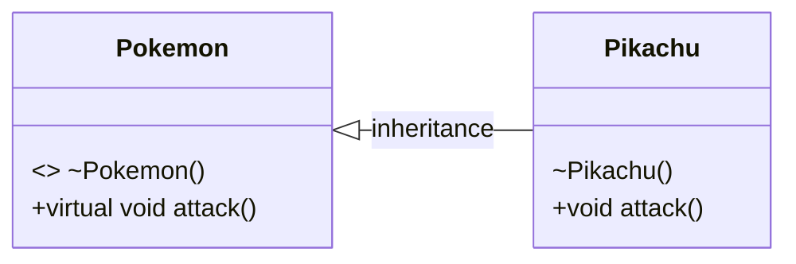

```mermaid
classDiagram
    direction LR
    class Pokemon {
        <<virtual>> ~Pokemon()
        +virtual void attack()
    }
    class Pikachu {
        ~Pikachu()
        +void attack()
    }
    Pokemon <|-- Pikachu : inheritance
```